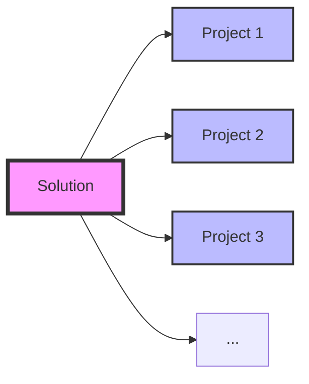

# 🎨 C# Design Patterns Collection


## 📋 Overview

This repository contains a comprehensive collection of **Design Patterns** implemented in **C#**. Each pattern is organized as a separate project within a single solution.

```
📦 DesignPatterns.sln
 ┣ 📂 Pattern1
 ┣ 📂 Pattern2
 ┣ 📂 Pattern3
 ┗ 📂 ...
```

## 🚀 Quick Start

```bash
# Clone the repository
git clone https://github.com/AshishBansal2101/DesignPattern.git

```

## 📊 Structure

| Component | Description |
|-----------|-------------|
| 💼 **Solution** | Single `.sln` file containing all patterns |
| 📁 **Projects** | Each pattern in its own project |
| 📝 **Examples** | Real-world usage demonstrations |

## 🛠️ Technologies

- **Language:** C# 12.0
- **Framework:** .NET 8.0
- **IDE:** Visual Studio 2022 / VS Code

## 📐 Architecture



## 🎯 Purpose

✨ **Learn** - Understand design patterns through practical examples  
🔧 **Apply** - Ready-to-use implementations for your projects  
📚 **Reference** - Quick lookup for pattern implementations  

---

<div align="center">
  
**Happy Coding!** 🚀

</div>
